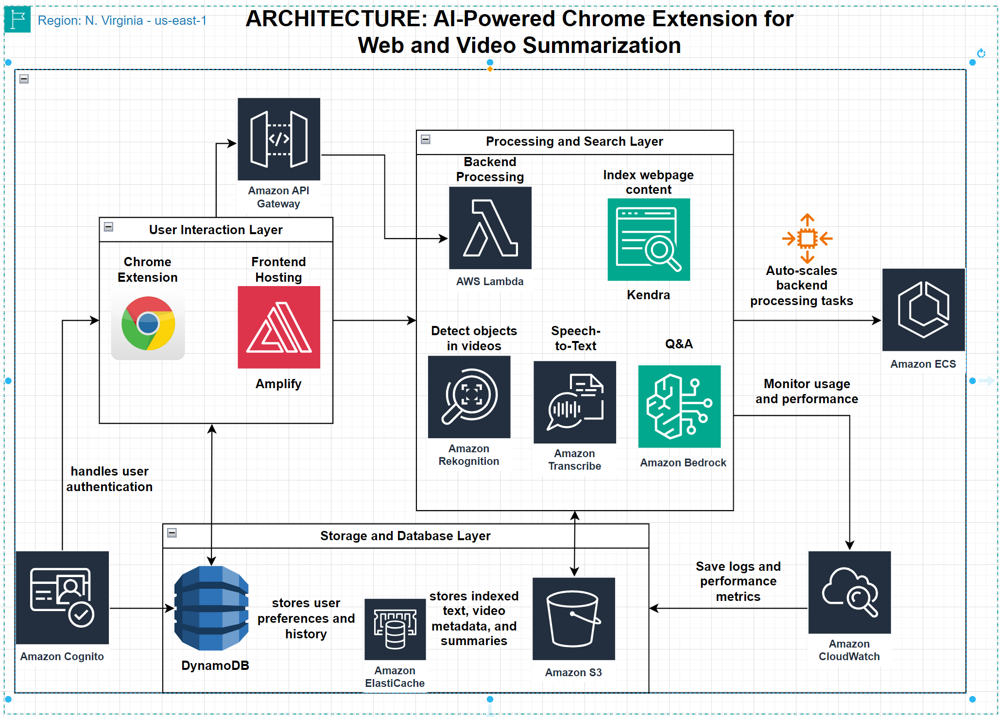

# BrevityCloud AI Assistant - Chrome Extension

***BrevityCloud enhances your browsing experience by providing AI-powered text summarization, page interaction via chat, image text detection, and voice input directly within your browser.***

## Features

*   **Webpage Summarization:** Get concise summaries of web articles using AWS Bedrock (Claude 3 Sonnet) or AWS Kendra.
*   **Chat with Page Context:** Ask questions about the current webpage content.
*   **Image Text Detection:** Right-click on any image on a webpage to detect and extract text using AWS Rekognition.
*   **Voice Input:** Use your microphone to dictate queries instead of typing.
*   **User Authentication:** Secure user accounts managed by AWS Cognito.
*   **History:** View your recent summaries and chat interactions.

## Architecture

*   **Frontend:** Chrome Extension (Manifest V3) using HTML, CSS, JavaScript.
*   **Backend:** Serverless functions on AWS Lambda (Python 3.9).
*   **API:** Amazon API Gateway (HTTP API).
*   **AI/ML Services:**
    *   AWS Bedrock (Anthropic Claude 3 Sonnet) for summarization & chat QA.
    *   AWS Kendra for Retrieval-Augmented Generation (RAG) based summarization/chat.
    *   AWS Rekognition for image text detection.
    *   AWS Transcribe for voice-to-text.
*   **Authentication:** AWS Cognito.
*   **Database:** AWS DynamoDB for user data and history.
*   **Storage:** AWS S3 for webpage content indexing (Kendra) and temporary audio files (Transcribe).
*   **Infrastructure as Code:** Terraform with modular structure.

## Getting Started

For detailed setup instructions, usage scenarios, and development information, please see the **[USER MANUAL](USER-MANUAL.md)**.

