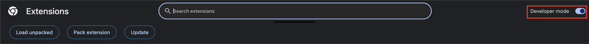

# BrevityCloud AI Assistant - User Manual

This document provides detailed instructions on how to set up, configure, and use the BrevityCloud AI Assistant Chrome Extension.

## Table of Contents

1.  [Prerequisites](#prerequisites)
2.  [AWS Setup](#aws-setup)
3.  [Backend Deployment (Automated)](#backend-deployment-automated)
4.  [Backend Deployment (Automated)](#backend-deployment-terraform)
5.  [Usage Scenarios](#usage-scenarios)
    *   [Registration & Login](#registration--login)
    *   [Summarizing a Webpage](#summarizing-a-webpage)
    *   [Chatting with Page Context](#chatting-with-page-context)
    *   [Detecting Text in Images](#detecting-text-in-images)
    *   [Using Voice Input](#using-voice-input)
    *   [Viewing History](#viewing-history)
    *   [Logging Out](#logging-out)
6.  [Troubleshooting](#troubleshooting)
7.  [Development Notes](#development-notes)

---

## 1. Prerequisites

*   **Git:** To clone the repository.
*   **AWS Account:** With permissions to create the necessary resources (IAM, Lambda, API Gateway, Cognito, DynamoDB, S3, Kendra, Bedrock, Rekognition, Transcribe).
*   **AWS CLI:** Installed and configured with credentials (`aws configure`).
*   **Terraform:** Installed (version 1.x recommended).
*   **Python:** (Version 3.9 recommended, matching Lambda runtime) with `pip` for packaging dependencies.
*   **Web Browser:** Google Chrome or a Chromium-based browser that supports extensions.
*   **(Optional) Shell Environment:** Bash (Linux/macOS/WSL) or PowerShell (Windows) for running packaging scripts.

## 2. AWS Setup

1.  **Configure AWS Credentials:** If you haven't already, configure your AWS CLI:
    ```bash
    aws configure
    # Enter your Access Key ID, Secret Access Key, Default region (e.g., us-east-1), Default output format (e.g., json)
    ```
2.  **Enable AWS Bedrock Model Access:**
    *   Navigate to the AWS Bedrock console in your chosen region.
    *   Go to "Model access" (or similar section).
    *   Request access and ensure access is granted for the model used in `backend/summarize.py` (currently `anthropic.claude-3-sonnet-20240229-v1:0`).

# 3. BrevityCloud Deployment Instructions (Automated Setup)

Follow these steps to automatically deploy your infrastructure and update the Chrome extension.

---

## 3.1 GitHub Secrets Setup

Set your AWS credentials securely under GitHub Secrets:

- **AWS_ACCESS_KEY_{FIRSTNAME}** → Your AWS Access Key ID
- **AWS_SECRET_KEY_{FIRSTNAME}** → Your AWS Secret Access Key

All in **UPPERCASE** for secret names.

**Example:**
- For Professor Michael:  
  - `AWS_ACCESS_KEY_MICHAEL`
  - `AWS_SECRET_KEY_MICHAEL`
- For TA Shireen:  
  - `AWS_ACCESS_KEY_SHIREEN`
  - `AWS_SECRET_KEY_SHIREEN`
- For TA Peyton:  
  - `AWS_ACCESS_KEY_PEYTON`
  - `AWS_SECRET_KEY_PEYTON`

---

## 3.2 Deploy Infrastructure via GitHub Actions

- Navigate to **GitHub → Actions → Terraform Apply**.
- Click **"Run workflow"**.
- Enter **your first name in lowercase** (e.g., `michael`, `shireen`, `peyton`).
- Sit back and relax — deployment will complete in about **5 minutes**.

---

## 3.3 Enable Developer Mode on Chrome (Please use on default chrome account)

Prepare Chrome for loading your extension:

- Open Chrome and go to:  
  `chrome://extensions/`
- **Enable Developer Mode** (top-right toggle).



---

## 3.4 Load the Extension (First Time Only)

Because Chrome restricts auto-creating extensions:

1. In `chrome://extensions/`, click **"Load unpacked"** (top-left).
2. Select the `/extension` folder from the project.
3. The extension will appear in your list.

> _Note: You only need to load manually once._

---

## 3.5 Sync Latest Endpoints & Reload Extension

Once infrastructure is deployed (From project's root directory):

- On **Mac/Linux**, run:
  ```bash
  bash deploy.sh

- On **Windows**, run:
  ```powershell
  .\deployment.ps1

The app should be up and running

## 3.6 Destory Resources and Spin down Infrastructure

- Navigate to **GitHub → Actions → Terraform Destroy**.
- Click **"Run workflow"**.
- Enter **your first name in lowercase (Same name you used for apply)** (e.g., `michael`, `shireen`, `peyton`).
- Please give some time for deployment to complete In average it takes **25-30 minutes**.


# 3. BrevityCloud Deployment Instructions (Manual/Local Setup)

## 4.1 Backend Deployment (Terraform)

The backend infrastructure (Lambda functions, API Gateway, Cognito, etc.) is managed by Terraform.

1.  **Navigate to Infrastructure Directory:**
    ```bash
    cd path/to/repository/infrastructure
    ```
2.  **Initialize Terraform:** Download necessary providers and modules.
    ```bash
    terraform init -upgrade
    ```
3.  **(Optional) Plan Changes:** See what resources Terraform will create/modify.
    ```bash
    terraform plan
    ```
4.  **Apply Changes:** Deploy the infrastructure (Requires packaging Lambdas first - see next section).
    *   _Do not run this yet, proceed to Section 4 first._
    ```bash
    # terraform apply -auto-approve 
    ```

## 4.2 Packaging Lambda Functions

Before applying Terraform changes that involve Lambda code updates, you need to create the deployment packages (.zip files).

1.  **Navigate to Backend Directory:**
    ```bash
    cd path/to/repository/backend
    ```
2.  **Install Dependencies (if not already installed for packaging):**
    *   It's recommended to use a virtual environment.
    *   `pip install -r requirements.txt` (Handles dependencies for summarize, rekognition, transcribe, auth)
3.  **Run Packaging Scripts:** Execute the scripts corresponding to the Lambda functions you need to update.
    *   **Summarize/History:**
        *   Bash: `bash package.sh`
        *   PowerShell: `.\package.ps1`
    *   **Authentication:**
        *   Bash: `bash package_auth.sh`
        *   PowerShell: `.\package_auth.ps1`
    *   **Rekognition:**
        *   Bash: `bash package_rekognition.sh`
        *   PowerShell: `.\package_rekognition.ps1`
    *   **Transcribe:**
        *   Bash: `bash package_transcribe.sh`
        *   PowerShell: `.\package_transcribe.ps1`

    These scripts create `.zip` files inside the `infrastructure/` directory, which Terraform uses.

## 4.3 Applying Infrastructure Changes

Once the necessary Lambda functions are packaged:

1.  **Navigate back to Infrastructure Directory:**
    ```bash
    cd ../infrastructure
    ```
2.  **Apply Terraform Configuration:**
    ```bash
    terraform apply -auto-approve
    ```
3.  **Note Terraform Outputs:** After applying, Terraform will output important values like the API Gateway endpoint URL and the Cognito Client ID. You will need these for the frontend setup.
    ```bash
    terraform output api_endpoint
    terraform output cognito_user_pool_client_id
    ```

## 4.4 Frontend Setup (Extension Loading)

1.  **Update Configuration:** Open the `extension/sidepanel.js` file in a text editor.
    *   Find the constants `API_ENDPOINT` and `COGNITO_CLIENT_ID` near the top.
    *   Replace the placeholder values with the actual values obtained from the `terraform output` command in the previous step.
    *   **Example:**
        ```javascript
        // Replace with your actual Terraform output
        const API_ENDPOINT = 'https://xxxxxxxxxx.execute-api.us-east-1.amazonaws.com/prod'; 
        const COGNITO_CLIENT_ID = 'xxxxxxxxxxxxxxxxxxxxxxxxxx'; 
        ```
    *   Save the file.
    *   *(Note: See Development Notes section regarding automating this update.)*

2.  **Load the Extension in Chrome:**
    *   Open Chrome and navigate to `chrome://extensions/`.
    *   Ensure **Developer mode** (usually a toggle in the top-right corner) is **enabled**.
    *   Click the **"Load unpacked"** button.
    *   In the file browser, navigate to and select the `extension` directory within your cloned repository.
    *   The BrevityCloud AI Assistant extension should now appear in your list of extensions.

3.  **Pin the Extension (Optional):** Click the puzzle piece icon in your Chrome toolbar and pin the BrevityCloud extension for easy access.

## 5. Usage Scenarios

### Registration & Login

1.  Click the BrevityCloud extension icon to open the side panel.
2.  If you are a new user, click the "Register" link.
3.  Enter your email address and a desired password. Click "Register".
4.  Check your email for a verification code from AWS Cognito.
5.  Enter the verification code in the side panel and click "Verify".
6.  You will be taken to the login screen. Enter your registered email and password, then click "Login".

### Summarizing a Webpage

1.  Navigate to a webpage you want to summarize.
2.  Ensure you are logged into the extension.
3.  Click the BrevityCloud extension icon.
4.  Select the desired processing model (Kendra or Bedrock) using the toggle buttons.
5.  Click the "Summarize this page" button.
6.  Wait for the loading indicator to finish. The summary will appear in the panel.

### Chatting with Page Context

1.  Summarize a page first (as above) to load its context.
2.  Type a question related to the page content in the input box at the bottom of the panel.
3.  Click "Send".
4.  The AI will answer your question based on the page's content. The response will appear below the summary.

### Detecting Text in Images

1.  Navigate to a webpage containing images.
2.  Ensure you are logged into the extension.
3.  Right-click on an image (`` tag) within the webpage.
4.  Select "Detect Text Using Amazon Rekognition" from the context menu.
5.  The side panel will open (if not already), display the selected image, and show the detected text in a text area below it.

### Using Voice Input

1.  Ensure you are logged into the extension.
2.  Click the microphone icon next to the chat input box.
3.  Your browser may ask for microphone permission; grant it.
4.  The microphone icon should change color (e.g., red) indicating it's recording.
5.  Speak your query clearly.
6.  Click the microphone icon again to stop recording.
7.  Wait for the transcription process. The transcribed text will appear in the chat input box.
8.  Click "Send" to submit the transcribed query.

### Viewing History

1.  Ensure you are logged into the extension.
2.  Click the "View History" button (below the Logout button).
3.  The panel will display your last 5 summaries and chat interactions, sorted by most recent.
4.  Click the "Back" button to return to the main summarization/chat view.

### Logging Out

1.  Click the "Logout" button at the bottom of the main panel.
2.  You will be returned to the login screen.

## 6. Troubleshooting

*   **"Network error occurred..." on Login:** Double-check the `API_ENDPOINT` in `sidepanel.js` matches the Terraform output exactly. Check browser developer console (F12 -> Network tab) for failed requests (CORS errors, 4xx/5xx codes).
*   **"Failed to generate summary" / "Internal server error":** Check CloudWatch Logs for the relevant Lambda function (`dev-brevity-cloud-summarize`, `dev-brevity-cloud-rekognition`, etc.) in the AWS region you deployed to. Look for Python errors or permission issues.
*   **Microphone Access Denied:** Ensure you granted microphone permission when prompted by the browser. You might need to check Chrome's site settings for the specific page or globally for extensions.
*   **Extension Doesn't Update After Navigation:** This is expected if not handled. The fix involves the `tabs.onUpdated` listener (implemented in the current code). If it's not working, ensure `background.js` and `sidepanel.js` have the latest code and reload the extension.
*   **Terraform Errors:** Carefully read the error message. It often points to missing permissions, incorrect variable values, resource conflicts, or syntax errors.

## 7. Development Notes

*   **Configuration:** Manually updating `sidepanel.js` with Terraform outputs is prone to error. Consider implementing a build step (e.g., using `sed`, `envsubst`, or a Node.js script) in a local script or CI/CD pipeline (like GitHub Actions) to automatically replace placeholder values before packaging the extension.
*   **Dependencies:** Remember to run the appropriate packaging script after modifying backend Python code or dependencies.
*   **State Management:** The current frontend state management is basic. For more complex UIs, consider a lightweight state management library or pattern.
*   **Error Handling:** Frontend error handling can be improved to provide more specific user feedback.
*   **Security:** Review IAM permissions granted by Terraform. Ensure they follow the principle of least privilege.
*   **Costs:** Monitor AWS costs, especially for Bedrock, Kendra, Rekognition, and Transcribe, which are pay-per-use. 